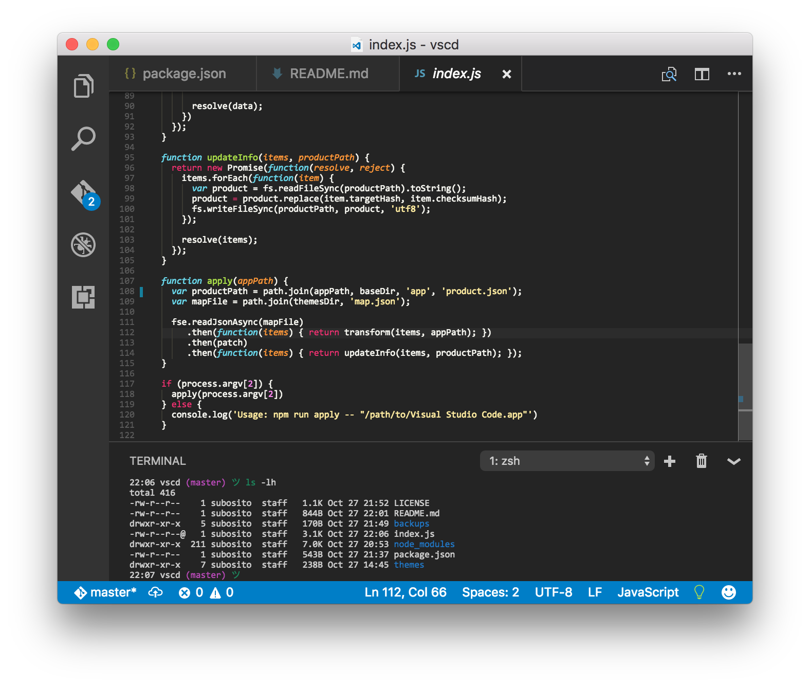
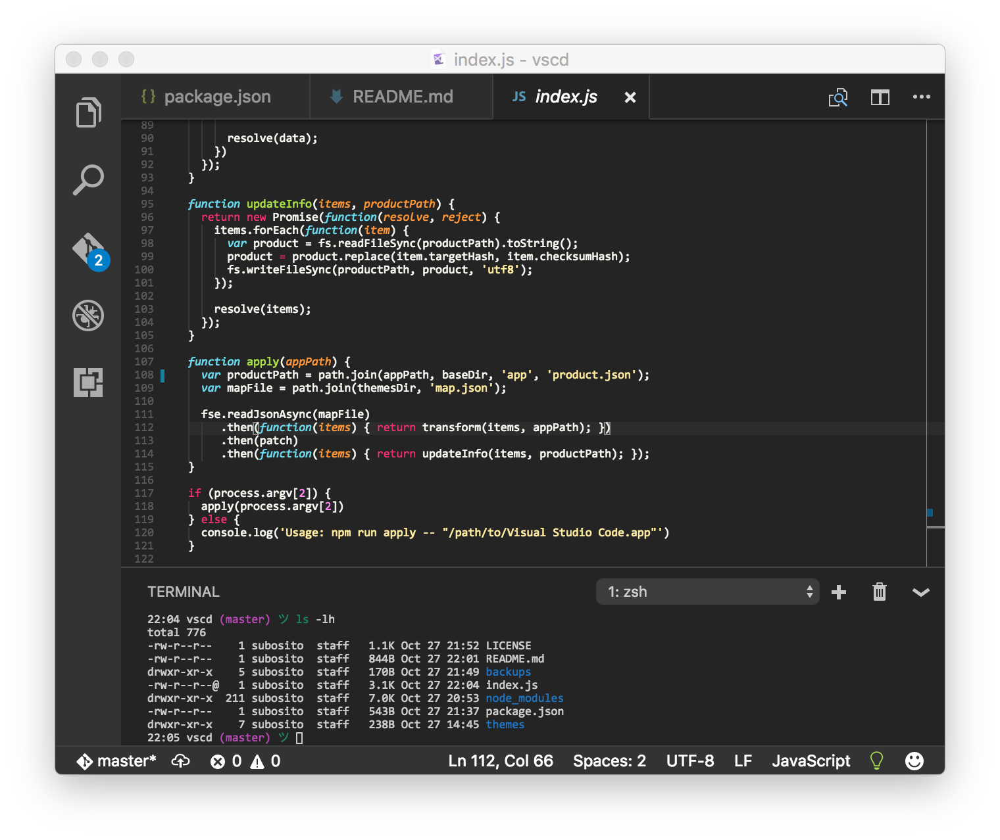
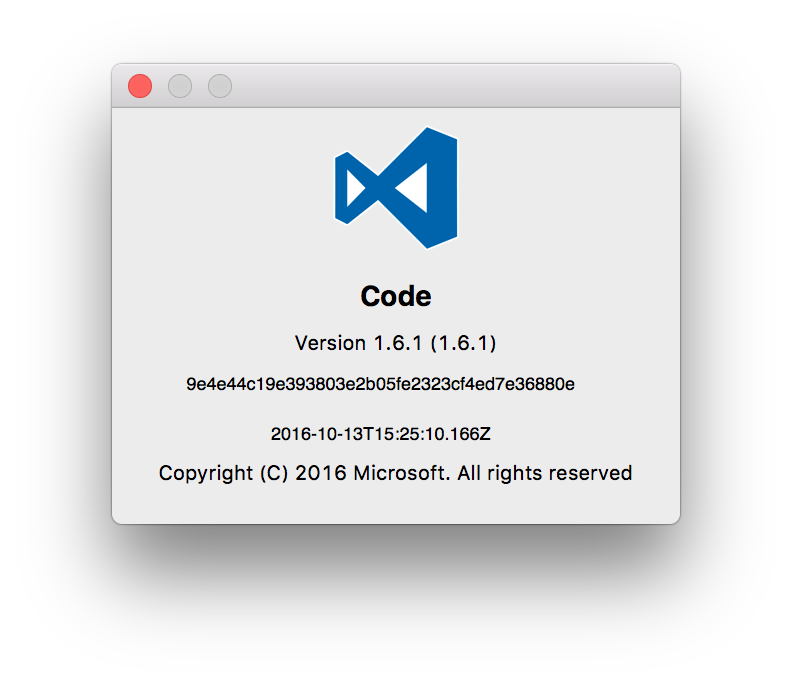
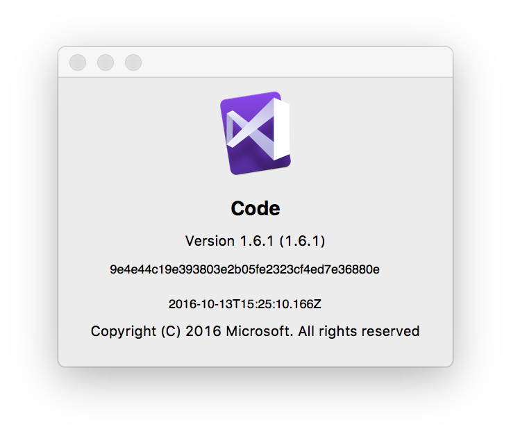
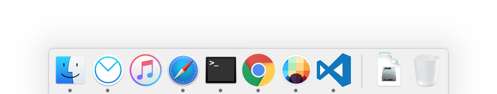
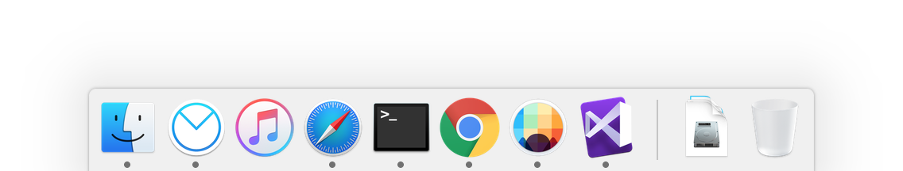

# vscd

[Visual Studio Code](https://code.visualstudio.com) customization tool.

This is a simple tool for customization until Visual Studio Code support it natively. You can track [the issue](https://github.com/Microsoft/vscode/issues/1833).

What it does is basically:

- Replace application and file type icon
- Change status bar color

Yeah, that's it. You can customize further by customizing files on `themes` directory.

## Screenshots

**Original window**



**Custom window**



**Original about**



**Custom about**



**Original dock**



**Custom dock**



> Note: changing dock icon needs to be done [manually](https://support.apple.com/kb/PH22191?locale=en_US).

## Usage

Before using this tool, you need to clone the repository:

```
$ git clone https://github.com/subosito/vscd.git
$ npm install
```

Once completed, then you can do:

```
$ npm run apply -- "/path/to/Visual Studio Code.app"
```

## Credits

- [Awesome application icon](http://santiagorpan.deviantart.com/art/Visual-Studio-Code-Yosemite-ICON-530012586) by [SantiagoRPan](http://santiagorpan.deviantart.com/)
